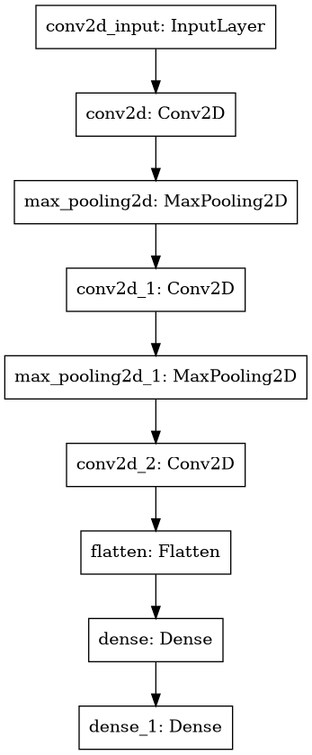
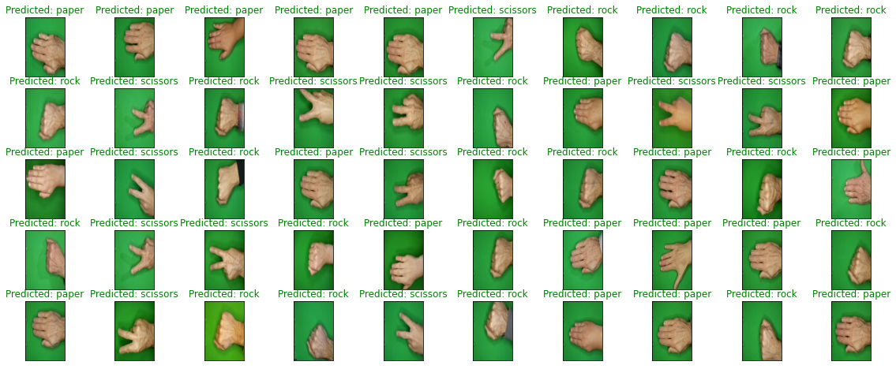

<h3 align="center">PiRockPaperScissors</h3>

    Play the classic game of Rock Paper Scissors with your Raspberry Pi with Machine Learning.
     
    <a href="#"><strong> Explore the docs » </strong></a>
     
     
    ·
    <a href="#">Report Bug</a>
    ·
    <a href="#">Request Feature</a>
    ·

### CNN Model with Keras

#### Architecture

#### Performance

| Loss   | Accuracy | Validation Loss | Validation Accuracy |
| ------ | -------- | --------------- | ------------------- |
| 0.0593 | 0.9787   | 0.1108          | 0.9722              |

#### Predictions

#### Training

Please refer to the `RPS CNN Training.ipynb` file in the notebooks folder.

## Contributing:

Contributions are what makes the open source community such an amazing place to learn, inspire, and create. Any contributions you make are **greatly appreciated**.

All you simply need to do is:

1. Fork the Project
2. Create your Feature Branch (`git checkout -b feature/AmazingFeature`)
3. Commit your Changes (`git commit -m 'Add some AmazingFeature'`)
4. Push to the Branch (`git push origin feature/AmazingFeature`)
5. Open a Pull Request
